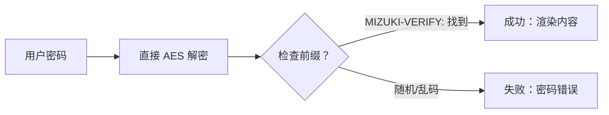

本博客模板基于 [Astro](https://astro.build/) 构建。本文未提及的内容，你可以在 [Astro 文档](https://docs.astro.build/) 中找到答案。

## 文章的 Front-matter

```yaml
---
title: 我的第一篇博客
published: 2026-03-21
description: 这是我的新 Astro 博客的第一篇文章。
image: ./cover.jpg
tags: [Foo, Bar]
category: 前端
draft: false
---
```


| 属性 | 说明 |
|------|------|
| `title` | 文章标题 |
| `published` | 文章发布日期 |
| `pinned` | 是否将文章置顶在文章列表顶部 |
| `description` | 文章简短描述，显示在首页列表 |
| `image` | 文章封面图路径。<br/>1. 以 `http://` 或 `https://` 开头：使用网络图片<br/>2. 以 `/` 开头：使用 `public` 目录中的图片<br/>3. 无以上前缀：相对于 Markdown 文件的路径 |
| `tags` | 文章标签 |
| `category` | 文章分类 |
| `alias` | 文章的别名。文章可通过 `/posts/{alias}/` 访问。示例：`my-special-article`（访问路径为 `/posts/my-special-article/`） |
| `licenseName` | 文章内容的许可证名称 |
| `author` | 文章作者 |
| `sourceLink` | 文章内容的来源链接或参考 |
| `draft` | 是否为草稿，草稿不会在页面上显示 |

## 文章文件存放位置

你的文章文件应放置在 `src/content/posts/` 目录下。你也可以创建子目录来更好地组织文章和资源文件。


```
src/content/posts/
├── post-1.md
└── post-2/
    ├── cover.png
    └── index.md
```


## 文章别名

你可以在 Front-matter 中添加 `alias` 字段来为任意文章设置别名：

```yaml
---
title: 我的特辑文章
published: 2024-01-15
alias: "my-special-article"
tags: ["示例"]
category: "技术"
---
```

设置别名后：
- 文章可通过自定义 URL 访问 (e.g., `/posts/my-special-article/`)
- 默认的 `/posts/{slug}/` 路径仍然有效
- RSS/Atom 订阅源将使用自定义别名
- 所有内部链接将自动使用自定义别名

**重要说明：**
- 别名不应包含 `/posts/`  前缀（系统会自动添加）
- 避免在别名中使用特殊字符和空格
- 建议使用小写字母和连字符，以获得最佳的 SEO 效果
- 确保所有文章的别名唯一
- 不要包含前导或尾随斜杠


## 工作原理


